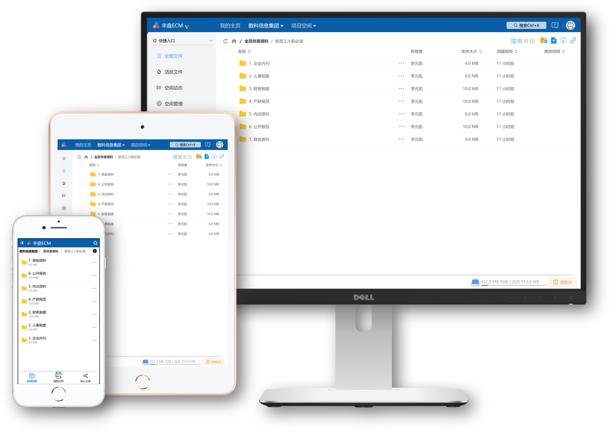
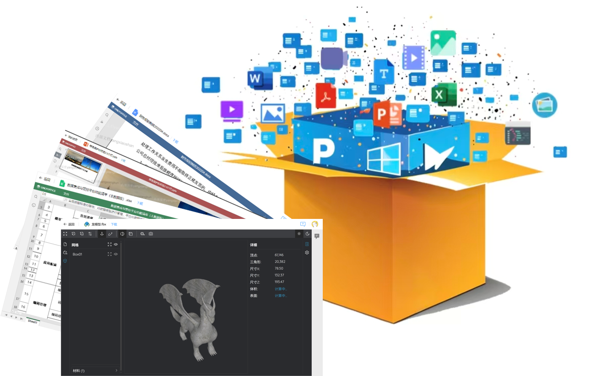
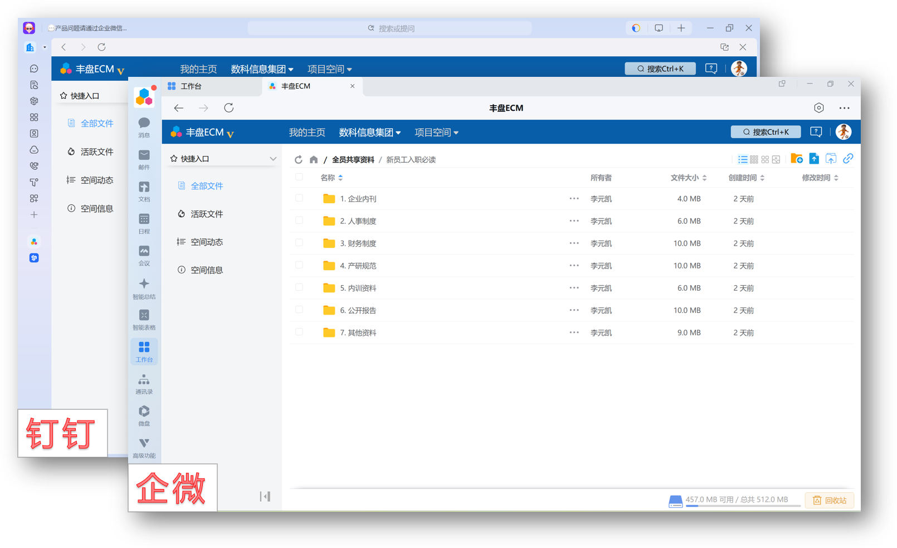
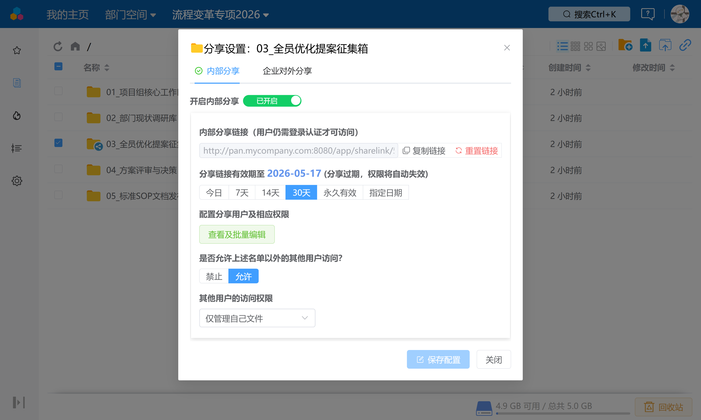
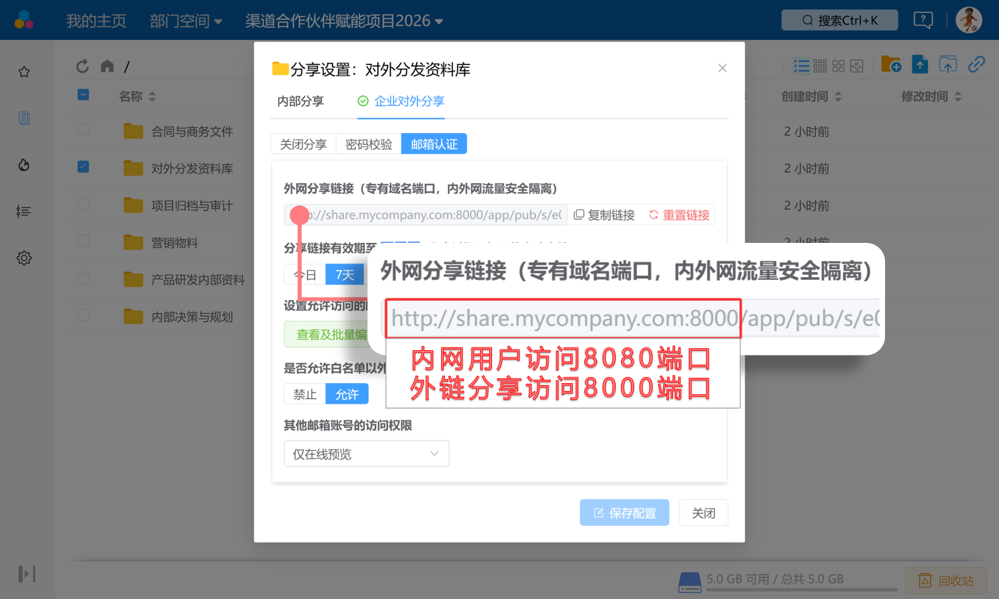
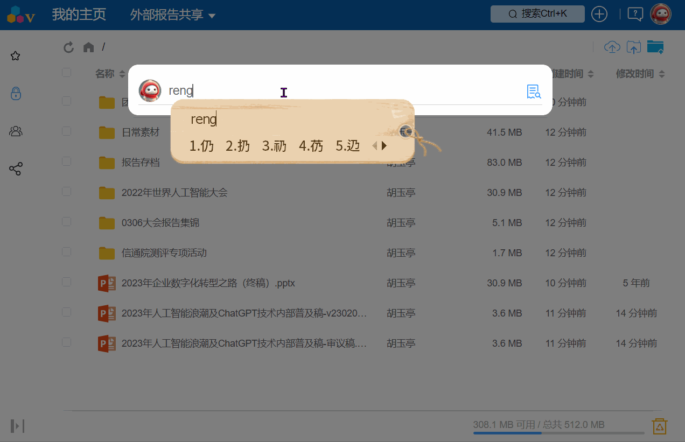

# 丰盘ECM产品概述

> **一句话介绍下丰盘ECM软件**
>
> 丰盘ECM（ [访问产品官网](https://www.ekbcloud.com/) ）是一款ECM类软件 (Enterprise Content Management 企业内容管理)，一款聚焦 **企业内部文档协同管理需求、支持私有化部署并且可长期免费使用** 的私有文档管理系统，提供与腾讯微盘、阿里云盘类似的产品体验，帮助企业在内网环境打造一体化的文档共享平台，**沉淀核心知识资产，提升知识流通效率，降低数据泄露风险**。

### :dart: 最新版 v26.9 (发布于2026年09月)

## 🚀本次更新速览

#### 👥 用户组与权限体系全面增强

系统管理员现在可以统一维护用户组及其成员关系，并将用户组直接应用于文档空间目录权限以及内外网分享授权。通过基于用户组的统一授权机制，企业可以按照部门、岗位、项目组等组织关系进行权限管理，无需逐个维护用户权限，有效降低大型企业的权限管理和维护成本。

#### 🏢 企业第三方登录认证新增飞书集成

本次版本新增 **飞书集成认证** 增值插件。至此，企微、钉钉、飞书三大主流企业协作平台均已支持在丰盘 ECM 中进行第三方登录认证，企业可以根据自身 IT 环境和办公平台选型按需采购并启用对应功能插件。

同时，本次版本新增**默认首选登录方式**配置项。系统管理员可以根据企业实际使用情况，指定登录页面默认展示的首选登录方式，员工进入系统后即可直接使用最熟悉的登录方式，减少登录过程中的选择成本，降低企业内部培训和使用门槛。

此外，本次版本还优化了企微、钉钉场景下的跨端页面跳转体验，**无论用户最终选择继续使用浏览器访问，还是切换至桌面客户端，系统都能够保持原始访问上下文，并最终落地至员工最初点击的网盘链接。**

#### 🔐 企业外网分享全面升级为「对外资料门户」

本次版本对外网分享架构进行了全面升级，将传统的点对点分享模式升级为更加适合企业长期运营的**对外资料门户**模式。

新版外网分享支持外部用户通过**邮箱验证码登录外网分享域名下的对外资料门户**。登录后，用户可以直接查看所有授权给其邮箱账号的共享资料，无需记忆或保存多个独立分享链接。企业可以据此建立更加统一、安全、可控的外部资料交换入口，适用于客户资料交付、渠道合作伙伴资料共享、经销商资料分发、门店及加盟商资料管理、企业与外部合作方之间的文档交换等场景。

#### 📄 在线预览能力全面提升

本次版本进一步增强在线文档预览能力，新增 **Markdown** 和 **HTML 网页内置预览器**，更好地满足 AI 大模型及现代软件开发场景下常见文档格式的在线预览需求。

由于 HTML 文件可能包含 JavaScript 等可执行脚本，为保障企业数字资产及用户访问安全，HTML 预览器引入了安全沙箱机制，并提供**严格（默认推荐）/ 受限 / 开放**三种安全级别，适用于常规文档预览、动态内容渲染以及高兼容性要求等不同场景。

同时，本次版本升级了 Word 轻量级预览组件，进一步改善了复杂文档的显示兼容性，并针对大文件预览优化了响应速度，相比依赖 OnlyOffice 套件的预览方式具有更快的响应体验。

#### 🛠其他优化与问题修复

**核心体验改进：**

* 🗂️ **空间管理：** 新增多种批量移除用户的操作方式，提升空间管理员的工作效率；
* 📚 **帮助文档：** 新增页面上下文帮助文档入口，并根据当前页面提供更具针对性的内容；支持在离网环境下通过手机扫码查阅，方便企业内网及隔离网络环境使用；
* 👁️ **预览体验：** 默认预览方式调整为居中弹窗模式，操作更加高效，同时仍支持通过 `Ctrl + 鼠标` 在新窗口打开预览界面；优化预览界面返回文件所在目录的跳转体验；
* ⚡ **性能优化：** 优化系统首屏加载性能及整体响应速度；
* 🔑 **登录续签：** 优化登录令牌自动续签机制，减少登录频次，系统管理员可根据企业安全策略配置相应的令牌续签时长；

**其他调整：**

* 优化 macOS 微信客户端文件上传流程，引导用户通过系统浏览器完成上传，减少因资源限流导致的上传中断问题。

**BUG 修复：**

* 修复全文检索中文件数量过多时可能导致资源占用过高的问题；
* 修复 Windows 域控账号名称兼容性问题。

### :sparkles: 为什么选择丰盘？

国内互联网三巨头的办公协同平台钉钉、企微、飞书都提供了很不错的网盘或云文档产品，但产品与平台紧密集成，无法实现私有部署，或者私有部署的费用非常昂贵，多数企业无力承担。对于重视数据安全、不希望把核心数据托管在第三方互联网平台的企业来说，支持私有化部署仍旧是他们选型网盘类产品的必要条件。而国内提供私有化部署的面向企业的网盘产品，多数不提供免费版本。国外对标Dropbox的ownCloud/Nextcloud开源产品虽然支持私有化部署，但在企业权限管理和协作功能上不太符合国内企业用户的工作方式和使用习惯，更多被用于个人网盘或者小团队的协作。

丰盘ECM源自我们十几年从事大型国企央企信息化项目的实践发展而来的产品，产品围绕着企业客户的日常协作场景进行针对性的设计。丰盘ECM专注私有部署，不提供公共网盘服务；商业模式上采用了国外成熟企业软件厂商普遍使用的Freemium模式，即**社区版永久免费+商业版付费增值插件**，其中 **社区版不限用户数、不限使用时长、永久免费**，满足企业最基础的文档管理诉求，可用于替代传统Windows SMB共享、FTP服务器或者SVN版本管理工具的作用；商业版通过插件市场，提供差异化的付费增值功能，满足企业高阶的需求。与国外同类开源产品相比，丰盘ECM在权限管控方面更为精细化，适合不同规模的团队的协作管理需求；同时，产品在整体界面设计和交互体验上更符合国人的操作习惯。自2020年推出永久免费版本至今，社区版功能仍在持续增强，而已有的免费功能也从未转换为商业付费功能，很好保持了免费与商业化的平衡。

丰盘ECM代码尚未开源，我们将在未来商业化进展到合适的时机开放我们的产品底座源代码，通过商业增值插件计费，欢迎关注⭐

**快捷链接：**

* [立即安装部署体验](https://www.ekbcloud.com/docs/admin_manual/setup.html)
* [查看产品帮助手册](https://www.ekbcloud.com/docs/)
* [关注行业产品最新动态](https://www.ekbcloud.com/blog/)
* [了解商业版差异及报价](https://www.ekbcloud.com/pricing)

### :gem: 功能速览

#### 随时随地共享内部文档

`高效协同` `大小屏幕适配`

集中式的文档系统部署，企业资料不用分散在每个部门、每位员工的手里。打破部门信息孤岛。员工可通过手机、平板和电脑随时安全访问最新资料，实时获取最新版本，告别聊天软件中混乱低效的反复传输。

#### 百余种格式极速在线预览

`原画预览` `免下载`

无需下载即可在线查看 PDF/Word/Excel/PPT 等主流办公文档，更支持STL/OBJ/IGS/STEP等十余种3D专业模型，从源头降低资料下载导致的安全泄密风险。

#### 无缝对接企微/钉钉/飞书/微软域控

`单点登录` `多账号融合`

全面打通Windows域控、OpenLDAP、泛微/蓝凌/致远OA以及企微/钉钉/飞书/微软Azure账号体系。实现扫码免密登录与工作台无缝嵌入，是微盘/钉盘绝佳的私有化替代方案。

#### 创建具有时效性的文件收集链接

`链接分享` `文件收集`

告别繁杂的权限申请，一键开启资料分享，链接发微信群访问时自动应用默认权限，可为少数账号单独配置高权限；逾期自动失效，历史链接随时重置。零管理成本，适用于企业内部快速收集资料、短期分享资料等场景。

#### 自建企业对外资料门户

`文件外发` `端口级流量隔离`

与企业外部的客户、合作伙伴、经销商、门店加盟商等用户实现安全高效的文件外发和协作，无需创建内部账号。内外网共用一套系统，免去繁琐的文件摆渡、多版本同步。通过专用端口物理隔离流量，对外发布带密码或邮箱白名单的安全链接。

#### 毫秒级文档搜索，权限精准过滤

`文档搜索` `权限感知`

如同百度谷歌必应的极致搜索体验，面对企业文档知识库存储的海量文档，毫秒检索返回。不仅支持文件及目录名称多关键词检索，更支持文档正文的检索。底层深度集成权限控制引擎，越权文件自动过滤，高效与安全并存。

